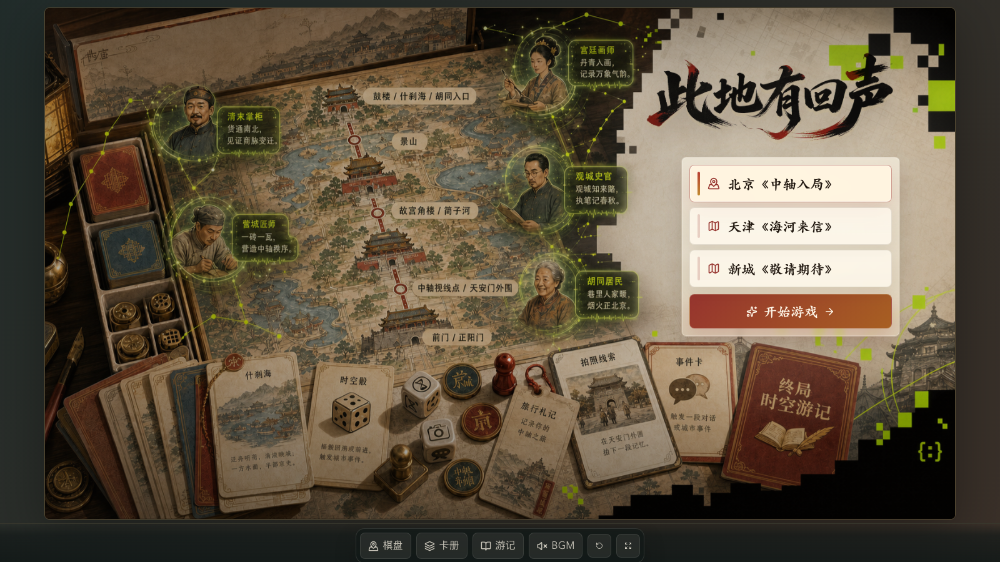
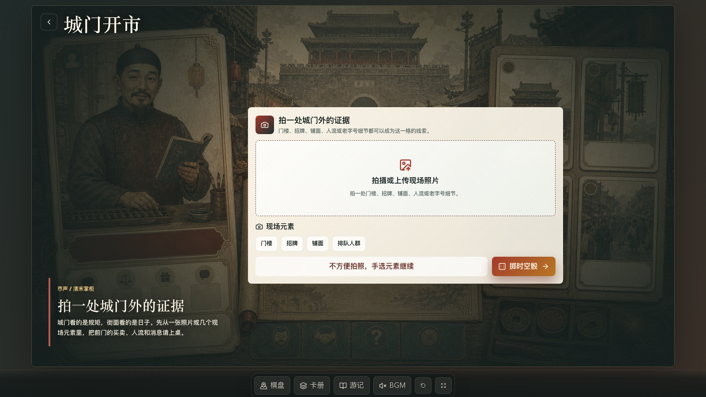
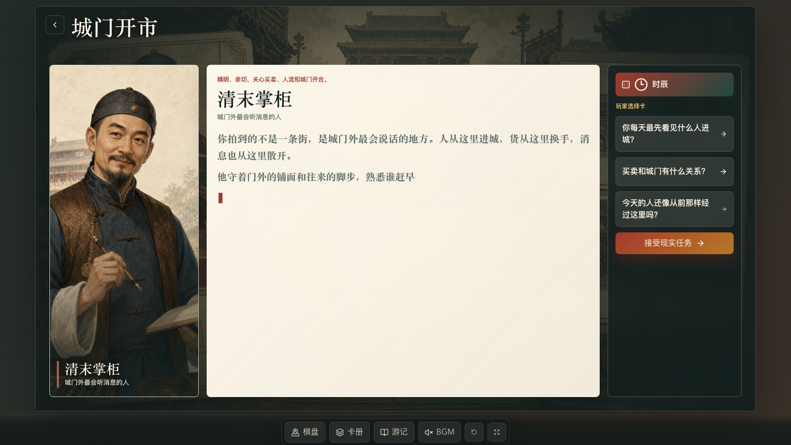
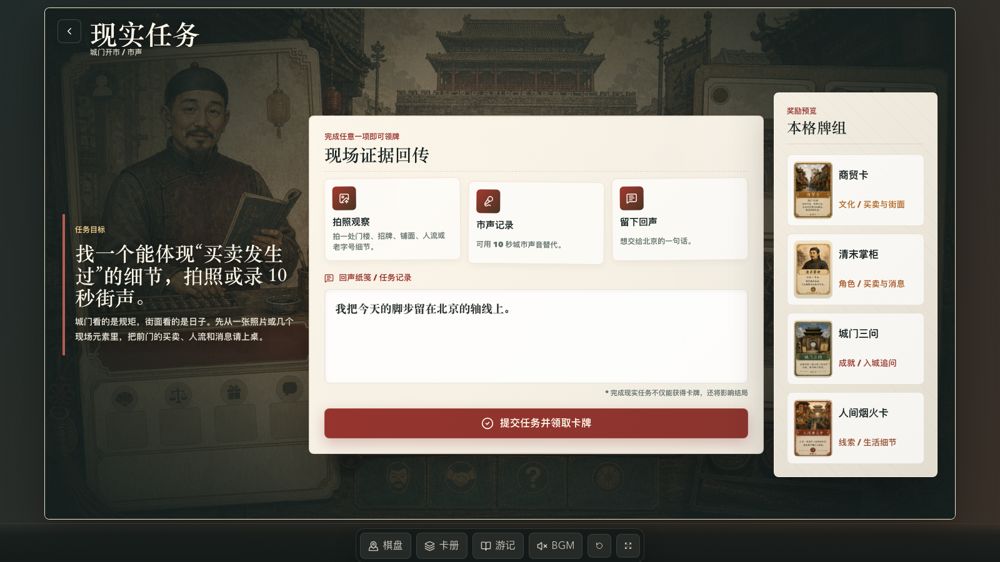
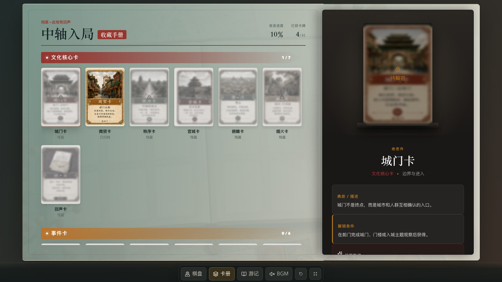
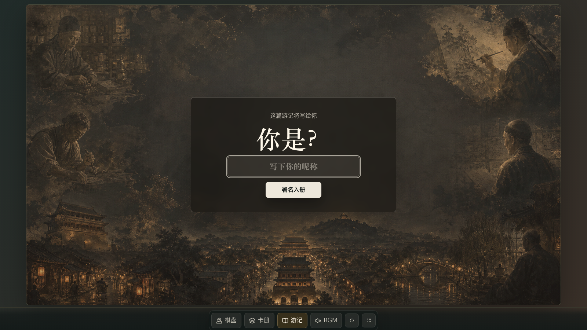

# 此地有回声：北京《中轴入局》

> 一款把真实城市路线、桌游棋盘、AI 角色剧场、拍照/听声任务和卡牌收集串起来的横屏文化游戏原型。


## 项目简介

《此地有回声》是一套 **AI 城市时空棋局**。玩家沿北京中轴线相关公共空间行走，每一步都落到一枚棋盘格：拍照、听声、抽事件、遇见角色、完成现实任务，并把获得的文化卡、角色卡和线索卡带入终局游记。

本仓库是北京首发章节 **《中轴入局》** 的完整可运行 Web 原型：

- **城市棋盘**：24 格外圈棋盘 + 北京中轴中心地图 + 玩家棋子走格。
- **场景事件**：每个关键格子使用独立 16:9 场景图作为舞台底板。
- **AI 剧场**：清末掌柜、营城匠师、宫廷画师、观城史官、胡同居民等角色用打字机动效回应玩家选择。
- **现实任务**：上传/拍摄照片、手选现场元素、模拟声音记录、留下回声句子。
- **卡牌系统**：完整 41 张 PNG 游戏卡牌，覆盖文化核心卡、事件卡、旅程成就卡、观察线索卡、功能兜底卡、剧场角色卡。
- **终局游记**：根据玩家获得的卡牌和留言生成本局路线回忆。

当前版本为本地前端原型，不需要后端服务、不需要登录，也不调用真实 AI 接口。

## 截图预览

<table>
  <tr>
    <td width="50%"></td>
    <td width="50%"></td>
  </tr>
  <tr>
    <td><strong>入口页</strong><br />选择北京《中轴入局》，进入横屏桌游舞台。</td>
    <td><strong>城市棋盘</strong><br />24 格外圈棋盘、中心路线地图、右侧当前回合和底部卡册。</td>
  </tr>
  <tr>
    <td></td>
    <td></td>
  </tr>
  <tr>
    <td><strong>场景任务</strong><br />每格使用专属背景图，上传框和兜底选择悬浮在场景之上。</td>
    <td><strong>AI 剧场</strong><br />角色卡、骰面语气和现场元素共同驱动打字机对白。</td>
  </tr>
  <tr>
    <td></td>
    <td></td>
  </tr>
  <tr>
    <td><strong>玩家选择</strong><br />右侧选择卡会直接改变中间剧情文本，并以打字机效果重新出现。</td>
    <td><strong>现实任务</strong><br />拍照观察、市声记录、留下回声，完成后领取本格牌组。</td>
  </tr>
  <tr>
    <td></td>
    <td></td>
  </tr>
  <tr>
    <td><strong>卡牌册</strong><br />41 张游戏卡按类型展示，已获得和未解锁状态分明。</td>
    <td><strong>终局游记</strong><br />把路线、卡牌和回声句子收束成一份本局北京故事。</td>
  </tr>
</table>

## 快速启动

### 直接下载桌面版

如果不想配置 Node.js，可以在 GitHub Releases 下载桌面安装包：

- macOS Apple Silicon：下载 `Colorbook-Beijing-*-mac-arm64.dmg`
- macOS Intel：下载 `Colorbook-Beijing-*-mac-x64.dmg`
- Windows 64 位：下载 `Colorbook-Beijing-*-windows-x64.exe`

桌面版内置完整游戏资产，不需要后端服务。macOS 首次打开未签名 DMG 时，可能需要在「系统设置 → 隐私与安全性」里允许打开。

### 环境要求

- Node.js 20 或更新版本
- npm 10 或更新版本
- 推荐使用桌面浏览器，以 16:9 横屏窗口体验

### 本地运行

```bash
npm install
npm run dev -- --host 127.0.0.1
```

打开：

```text
http://127.0.0.1:5173/
```

### 生产构建

```bash
npm run build
npm run preview
```

### 桌面包构建

```bash
npm run desktop:build -- --mac dmg
npm run desktop:build -- --win nsis
```

仓库已配置 GitHub Actions：推送 `v*` 标签时，会自动在 macOS/Windows runner 上构建 DMG 和 EXE，并挂到对应 GitHub Release。

### 代码检查

```bash
npm run lint
```

## 游戏流程

1. **进入章节**：从入口页选择北京《中轴入局》。
2. **查看棋盘**：棋子落在当前格，右侧显示当前回合角色和任务触发。
3. **打开场景**：进入该格的 16:9 场景任务页。
4. **上传/手选证据**：拍摄现场照片，或用手选元素作为兜底继续。
5. **掷时空骰**：骰面决定剧场语气，如时辰、风物、来信、市声、转折、回声。
6. **角色剧场**：玩家选择追问，角色用打字机对白回应。
7. **完成现实任务**：拍照观察、市声记录或留下回声。
8. **领取卡牌**：获得文化卡、角色卡、线索卡或成就卡。
9. **继续走格**：回到棋盘进入下一地点。
10. **生成游记**：终局页根据卡牌和回声句子生成北京路线故事。

## 内容与资产

仓库已包含运行所需的完整本地资产：

- `public/assets/beijing/tile-scenes-24/`：24 张棋盘格二级场景背景图。
- `public/assets/beijing/tile-buttons/`：24 张棋盘按钮图。
- `public/assets/beijing/deck/`：41 张正式游戏卡牌 PNG。
- `public/assets/beijing/role-cards/`：剧场角色卡图。
- `public/assets/beijing/board/`：棋盘中心地图与棋盘相关素材。
- `public/assets/beijing/ui/`：上传框、对话框、奖励光效、印章等 UI 组件素材。
- `public/audio/`：北京篇 BGM 与交互音效。
- `docs/screenshots/`：README 展示截图，由浏览器自动化从当前版本生成。

## 技术栈

- React 19
- TypeScript
- Vite
- lucide-react 图标
- 原生 CSS 变量与响应式舞台布局
- 本地 TypeScript 内容配置，无后端依赖

## 项目结构

```text
.
├── public/
│   ├── assets/beijing/       # 北京篇完整视觉资产
│   └── audio/                # BGM 与 UI 音效
├── src/
│   ├── components/           # GameShell、棋盘、手牌、卡牌渲染等组件
│   ├── data/                 # 北京路线、卡牌、棋盘轨道、任务与素材配置
│   ├── screens/              # 入口、棋盘、场景、剧场、任务、卡册、终局页面
│   ├── App.tsx               # 主流程状态机
│   └── App.css               # 横屏桌游视觉系统
├── electron/                 # Electron 桌面壳与本地资源协议
├── .github/workflows/        # 自动构建 DMG / EXE 并发布 Release
├── docs/screenshots/         # README 截图
├── package.json
└── vite.config.ts
```

## 关键文件

- `electron/main.cjs`：桌面版入口，负责加载生产构建后的游戏和本地资源。
- `.github/workflows/desktop-release.yml`：GitHub Actions 桌面自动出包与 Release 发布流程。
- `src/App.tsx`：页面流程、玩家状态、卡牌收集与任务完成逻辑。
- `src/data/boardTrack.ts`：24 格棋盘顺序、坐标和棋子走格路径。
- `src/data/beijingGame.ts`：5 个主线地点、角色、任务、骰面和奖励规则。
- `src/data/gameCards.ts`：41 张卡牌的数据、分类、解锁规则和效果。
- `src/data/tileScenes.ts`：场景页背景图、任务说明和角色扩展文案。
- `src/screens/PhotoTriggerScreen.tsx`：拍照/手选现场元素场景页。
- `src/screens/TheaterScreen.tsx`：AI 剧场与打字机对白。
- `src/screens/MissionScreen.tsx`：现实任务与奖励牌组页。
- `src/screens/CardAlbumScreen.tsx`：完整卡牌册。
- `src/screens/FinaleScreen.tsx`：终局游记。

## 设计方向

这个原型避免做成普通文旅官网或静态导览页，而是把北京中轴线包装成一盘可行走的桌游：

- 背景像古城档案和纸上剧场。
- UI 像桌游组件、任务牌、卡牌册和路线章。
- 玩家不是“听讲解的人”，而是被城市询问、被角色邀请入局的人。
- 错过、天气、人流和不方便拍照都不是失败，而是被写进故事的路线分支。

## 当前限制

- AI 对话为本地 mock 文案，尚未接后端模型。
- 拍照上传只记录文件名，不做真实图像识别。
- 声音任务为交互模拟，尚未接麦克风录音分析。
- 地图、定位、天气接口尚未接入。
- 当前重点是横屏路演和本地演示，移动端体验不是主要目标。

## 许可证与素材说明

本仓库包含项目内生成和整理的视觉资产、卡牌资产、UI 资产与本地音效。若用于公开发布、商业展演或二次发行，请先确认素材来源和授权边界。
