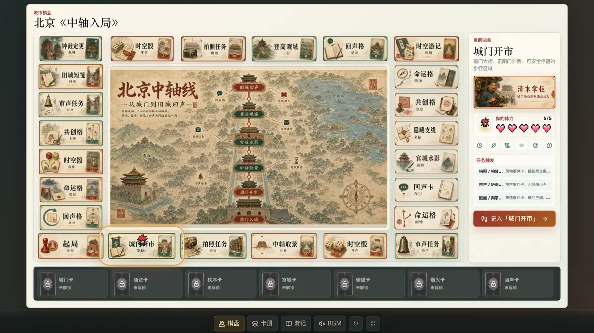
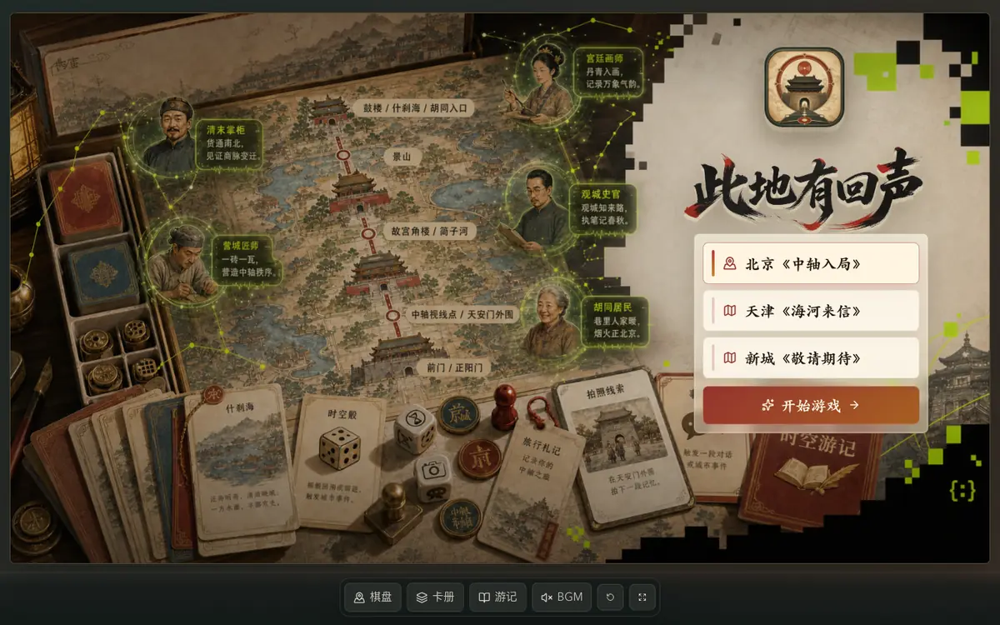
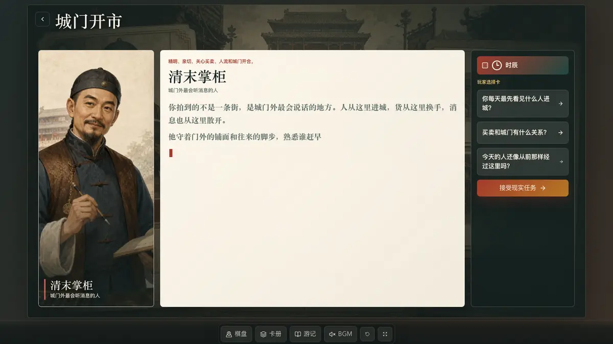
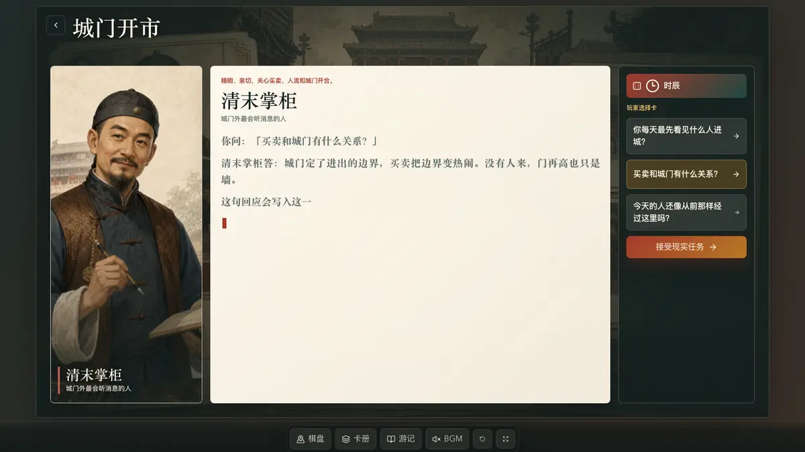
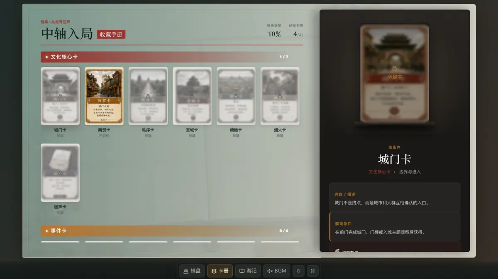
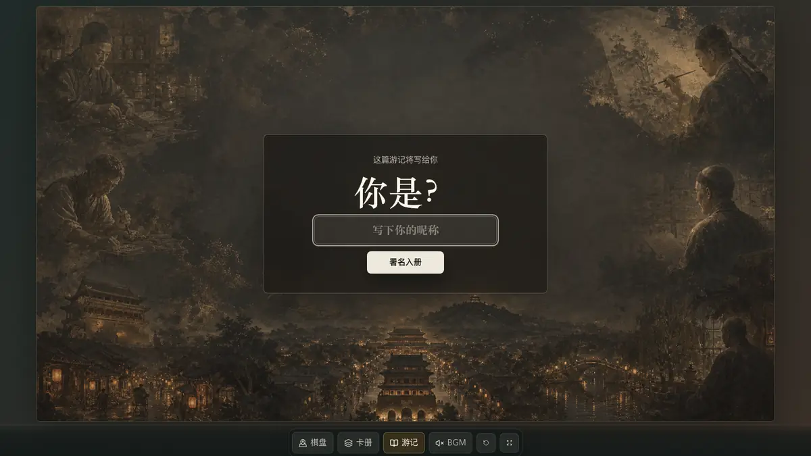
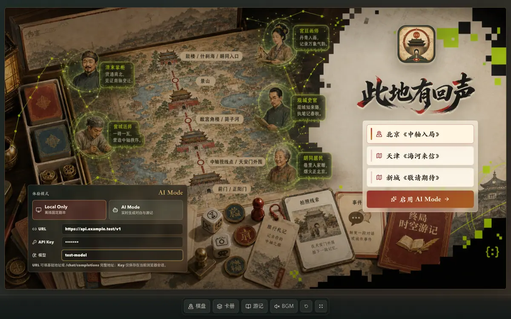

# 此地有回声：北京《中轴入局》

> 一款把真实城市路线、桌游棋盘、AI 角色剧场、拍照/听声任务和卡牌收集串起来的横屏文化游戏原型。



## 项目简介

《此地有回声》是一套 **AI 城市时空棋局**。玩家沿北京中轴线相关公共空间行走，每一步都落到一枚棋盘格：拍照、听声、抽事件、遇见角色、完成现实任务，并把获得的文化卡、角色卡和线索卡带入终局游记。

本仓库是北京首发章节 **《中轴入局》** 的完整可运行 Web 原型：

- **城市棋盘**：24 格外圈棋盘 + 北京中轴中心地图 + 玩家棋子按 1-6 点随机前进。
- **随机事件**：落到拍照、市声、命运、回声、共创、游记等事件格时，会抽取不同事件牌改变任务、奖励和故事语气。
- **场景事件**：24 个棋盘格都接入独立 16:9 场景图作为舞台底板。
- **AI 剧场**：清末掌柜、营城匠师、宫廷画师、观城史官、胡同居民等角色用打字机动效回应玩家选择。
- **AI Mode**：开局可选择 OpenAI 兼容端点，实时生成角色对白和终局游记。
- **现实任务**：上传/拍摄照片、手选现场元素、模拟声音记录、留下回声句子。
- **卡牌系统**：完整 41 张 PNG 游戏卡牌，覆盖文化核心卡、事件卡、旅程成就卡、观察线索卡、功能兜底卡、剧场角色卡。
- **终局游记**：根据玩家获得的卡牌和留言生成本局路线回忆。

当前版本不需要后端服务、不需要登录。默认 `Local Only` 模式全程离线运行；可选 `AI Mode` 会在浏览器中调用玩家自己填写的 OpenAI 兼容端点。

## 截图预览

<table>
  <tr>
    <td width="50%"></td>
    <td width="50%"></td>
  </tr>
  <tr>
    <td><strong>入口页</strong><br />选择北京《中轴入局》，进入横屏桌游舞台。</td>
    <td><strong>城市棋盘</strong><br />24 格外圈棋盘、中心路线地图、右侧当前回合和底部卡册。</td>
  </tr>
  <tr>
    <td></td>
    <td></td>
  </tr>
  <tr>
    <td><strong>场景任务</strong><br />每格使用专属背景图，上传框和兜底选择悬浮在场景之上。</td>
    <td><strong>AI 剧场</strong><br />角色卡、骰面语气和现场元素共同驱动打字机对白。</td>
  </tr>
  <tr>
    <td></td>
    <td></td>
  </tr>
  <tr>
    <td><strong>玩家选择</strong><br />右侧选择卡会直接改变中间剧情文本，并以打字机效果重新出现。</td>
    <td><strong>现实任务</strong><br />拍照观察、市声记录、留下回声，完成后领取本格牌组。</td>
  </tr>
  <tr>
    <td></td>
    <td></td>
  </tr>
  <tr>
    <td><strong>卡牌册</strong><br />41 张游戏卡按类型展示，已获得和未解锁状态分明。</td>
    <td><strong>终局游记</strong><br />把路线、卡牌和回声句子收束成一份本局北京故事。</td>
  </tr>
  <tr>
    <td colspan="2"></td>
  </tr>
  <tr>
    <td colspan="2"><strong>AI Mode</strong><br />开局输入 URL、API Key 和模型名，后续剧场对白与终局游记会根据玩家行为实时生成。</td>
  </tr>
</table>

## 快速启动

### 直接下载安装包

如果不想配置 Node.js，可以在 GitHub Releases 下载各平台安装包：

- macOS Apple Silicon：下载 `Colorbook-Beijing-*-mac-arm64.dmg`
- macOS Intel：下载 `Colorbook-Beijing-*-mac-x64.dmg`
- Windows 64 位：下载 `Colorbook-Beijing-*-windows-x64.exe`
- Android：下载 `Colorbook-Beijing-*-android-debug.apk`
- iOS：下载 `Colorbook-Beijing-*-ios-unsigned.ipa`

安装包内置完整游戏资产，不需要后端服务。macOS 首次打开未签名 DMG 时，可能需要在「系统设置 → 隐私与安全性」里允许打开。Android APK 使用调试签名，适合测试安装；iOS IPA 未签名，需要使用自己的 Apple 开发者证书重新签名后安装。

如果需要更快下载和安装，可以选择 `lite-v*` Release 里的轻量版安装包。轻量版会在打包前临时压缩主要图片素材，完整游戏流程不变。

### 选择游戏模式

入口页提供两种模式：

- `Local Only`：默认模式，所有对白和游记都来自本地剧本，不联网、不需要 API Key。
- `AI Mode`：输入 OpenAI 兼容端点的 URL、API Key 和模型名后开始游戏。URL 可填写基础地址，例如 `/v1`，也可填写完整 `/chat/completions` 地址；端点需要允许浏览器跨域访问。

AI Mode 会把玩家当前行为作为上下文传给模型，包括城市章节、当前地点、骰面、手选现场元素、照片文件名、角色追问、现实任务留言、已获卡牌和路线进度。API Key 只保存在当前浏览器会话中；端点 URL 和模型名会保存在本机浏览器，方便下次继续测试。

### 环境要求

- Node.js 20 或更新版本
- npm 10 或更新版本
- 推荐使用桌面浏览器，以 16:9 横屏窗口体验

### 本地运行

```bash
npm install
npm run dev -- --host 127.0.0.1
```

打开：

```text
http://127.0.0.1:5173/
```

### 生产构建

```bash
npm run build
npm run preview
```

### 桌面包构建

```bash
npm run desktop:build -- --mac dmg
npm run desktop:build -- --win nsis
```

### 移动端构建

```bash
npm run mobile:sync
npm run android:apk
```

仓库已配置 GitHub Actions：推送 `v*` 标签时，会自动在 macOS、Windows、Ubuntu runner 上构建 DMG、EXE、APK 和未签名 IPA，并挂到对应 GitHub Release。

### 轻量版构建

```bash
npm run assets:lite
```

这条命令会压缩当前工作区的 `public` 图片资产；本地使用前请确认你是在临时副本或干净工作区中执行。GitHub Actions 的 `lite-v*` 标签会在云端临时执行压缩，不会改写仓库里的高清原图。

### 代码检查

```bash
npm run lint
```

## 游戏流程

1. **选择模式**：从入口页选择 `Local Only` 或配置 `AI Mode`。
2. **进入章节**：选择北京《中轴入局》。
3. **查看棋盘**：棋子落在当前格，右侧显示本回合点数、落点、事件牌和任务触发。
4. **打开场景**：进入该格的 16:9 场景任务页；事件格会使用对应的事件背景图。
5. **上传/手选证据**：拍摄现场照片，或用手选元素作为兜底继续。
6. **掷时空骰**：骰面决定剧场语气，如时辰、风物、来信、市声、转折、回声。
7. **角色剧场**：玩家选择追问，角色用打字机对白回应；AI Mode 会实时请求模型重写回应。
8. **完成现实任务**：拍照观察、市声记录或留下回声，并按地点、骰面、事件和现场元素领取卡牌。
9. **随机前进**：提交任务后自动掷 1-6 点移动，落到主线地点或随机事件格。
10. **继续走格**：每局路线顺序、事件牌、奖励组合和终局侧重点都会不同。
11. **生成游记**：终局页根据路线、卡牌、事件时间线和回声句子生成北京路线故事；AI Mode 会把完整行为时间线交给模型生成个性化游记。

## 内容与资产

仓库已包含运行所需的完整本地资产：

- `public/assets/beijing/tile-scenes-24/`：24 张棋盘格二级场景背景图。
- `public/assets/beijing/tile-buttons/`：24 张棋盘按钮图。
- `public/assets/beijing/deck/`：41 张正式游戏卡牌 PNG。
- `public/assets/beijing/role-cards/`：剧场角色卡图。
- `public/assets/beijing/board/`：棋盘中心地图与棋盘相关素材。
- `public/assets/beijing/ui/`：上传框、对话框、奖励光效、印章等 UI 组件素材。
- `public/assets/app-icon/`：应用图标与首页品牌图标资产。
- `public/audio/`：北京篇 BGM 与交互音效。
- `docs/screenshots/`：浏览器自动化生成的高清截图。
- `docs/screenshots/readme/`：README 专用压缩 WebP 预览图，用来提升 GitHub 页面加载速度。

## 技术栈

- React 19
- TypeScript
- Vite
- Capacitor
- lucide-react 图标
- 原生 CSS 变量与响应式舞台布局
- 本地 TypeScript 内容配置，无后端依赖

## 项目结构

```text
.
├── public/
│   ├── assets/beijing/       # 北京篇完整视觉资产
│   └── audio/                # BGM 与 UI 音效
├── src/
│   ├── components/           # GameShell、棋盘、手牌、卡牌渲染等组件
│   ├── data/                 # 北京路线、卡牌、棋盘轨道、任务与素材配置
│   ├── screens/              # 入口、棋盘、场景、剧场、任务、卡册、终局页面
│   ├── App.tsx               # 主流程状态机
│   └── App.css               # 横屏桌游视觉系统
├── electron/                 # Electron 桌面壳与本地资源协议
├── android/                  # Capacitor Android 容器
├── ios/                      # Capacitor iOS 容器
├── assets/app-icon/          # 应用图标源资产
├── build/                    # 桌面端图标资源
├── scripts/                  # 图标生成脚本
├── .github/workflows/        # 自动构建 DMG / EXE / APK / IPA 并发布 Release
├── docs/screenshots/         # 高清截图与 README 压缩预览图
├── capacitor.config.ts
├── package.json
└── vite.config.ts
```

## 关键文件

- `electron/main.cjs`：桌面版入口，负责加载生产构建后的游戏和本地资源。
- `capacitor.config.ts`：移动端应用 ID、应用名和 Web 构建目录配置。
- `scripts/generate-app-icons.mjs`：从统一图标源生成 Electron、Android、iOS 所需图标。
- `scripts/prepare-lite-assets.mjs`：为轻量安装包临时压缩主要图片资产。
- `android/`：Android 原生容器，可构建调试签名 APK。
- `ios/`：iOS 原生容器，可构建未签名 IPA，后续可接 Apple 证书签名。
- `.github/workflows/release-packages.yml`：GitHub Actions 全平台自动出包与 Release 发布流程。
- `src/App.tsx`：页面流程、玩家状态、卡牌收集与任务完成逻辑。
- `src/utils/openAiCompatible.ts`：OpenAI 兼容 `/chat/completions` 文本请求客户端。
- `src/utils/aiPrompts.ts`：AI Mode 剧场对白和终局游记的上下文组装。
- `src/data/boardTrack.ts`：24 格棋盘顺序、坐标和棋子走格路径。
- `src/data/randomEvents.ts`：随机移动、棋盘事件牌、事件奖励和节点落点规则。
- `src/data/beijingGame.ts`：5 个主线地点、角色、任务、骰面和奖励规则。
- `src/data/gameCards.ts`：41 张卡牌的数据、分类、解锁规则和效果。
- `src/data/tileScenes.ts`：场景页背景图、任务说明和角色扩展文案。
- `src/screens/PhotoTriggerScreen.tsx`：拍照/手选现场元素场景页。
- `src/screens/TheaterScreen.tsx`：AI 剧场与打字机对白。
- `src/screens/MissionScreen.tsx`：现实任务与奖励牌组页。
- `src/screens/CardAlbumScreen.tsx`：完整卡牌册。
- `src/screens/FinaleScreen.tsx`：终局游记。

## 设计方向

这个原型避免做成普通文旅官网或静态导览页，而是把北京中轴线包装成一盘可行走的桌游：

- 背景像古城档案和纸上剧场。
- UI 像桌游组件、任务牌、卡牌册和路线章。
- 玩家不是“听讲解的人”，而是被城市询问、被角色邀请入局的人。
- 错过、天气、人流和不方便拍照都不是失败，而是被写进故事的路线分支。

## 当前限制

- AI Mode 在浏览器端直连玩家填写的 OpenAI 兼容端点，没有内置服务端代理。
- 拍照上传只记录文件名，不做真实图像识别。
- 声音任务为交互模拟，尚未接麦克风录音分析。
- 地图、定位、天气接口尚未接入。
- 移动端包已可构建，但当前交互仍优先按横屏路演体验设计。
- iOS IPA 默认未签名，真机安装需要接入 Apple 开发者证书或后续走 TestFlight。

## 许可证与素材说明

本仓库包含项目内生成和整理的视觉资产、卡牌资产、UI 资产与本地音效。若用于公开发布、商业展演或二次发行，请先确认素材来源和授权边界。
